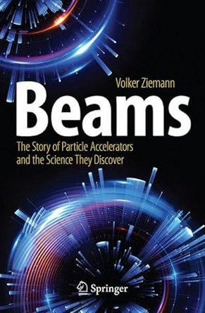

# Beams - The Story of Particle Accelerators and the Science They Discover

This page provides web links to publications mentioned in the
endnotes of my forthcoming book [Beams - The Story of Particle
Accelerators and the Science They Discover](https://link.springer.com/book/9783031518515).
The book will be published as a [Copernicus book](https://www.springer.com/series/17112)
by Springer in April 2024.

Many of the links point to JSTOR
([`https://www.jstor.org`](https://www.jstor.org)). The first page is
usually open to read, but access to the full document might either
require help from a friendly librarian or institutional access from a
school or a university. Pages from CERN Courier
([`https://cerncourier.com`](https://cerncourier.com)) or nobelprize.org
([`https://www.nobelprize.org`](https://www.nobelprize.org)) are openly
accessible.

Chapter 1: Introduction
======================

The answer to "what is physics?" provides the book's theme: to figure out the world and build
the instruments to help with the figuring. By focusing on the press conference
at CERN where the discovery of the Higgs boson was announced, the link between the figuring
(Higgs boson as last puzzle bit of the standard model) and the instruments (the Large Hadron
Collider and the detectors) is firmly established. The chapter then illustrates how physics
advances by distilling experiments into physical laws, a process referred to as 'unification'.

### Links

-   [`https://www.routledge.com/go/what-is-physics`](https://www.routledge.com/go/what-is-physics)
    
    
-   CERN web page [`https://www.cern.ch`](https://www.cern.ch).
    
    
-   The Press conference
    [`https://www.youtube.com/watch?v=AzX0dwbY4Yk`](https://www.youtube.com/watch?v=AzX0dwbY4Yk)
    and the press release
    [`https://home.cern/news/press-release/cern/cern-experiments-observe-particle-consistent-long-sought-higgs-boson`](https://home.cern/news/press-release/cern/cern-experiments-observe-particle-consistent-long-sought-higgs-boson)
    
    
-   Nobel prize for Peter Higgs and Francois Englert:
    [`https://www.nobelprize.org/prizes/physics/2013/summary/`](https://www.nobelprize.org/prizes/physics/2013/summary/).
    
    
-   Erwin Schrödinger, *What is Matter?* Scientific American, September
    1953, page 52. Available online from
    [`https://www.jstor.org/stable/24944334`](https://www.jstor.org/stable/24944334).
    George Gamow, *The Principle of Uncertainty,* Scientific American,
    January 1958, page 51. Available online from
    [`https://www.jstor.org/stable/24942034`](https://www.jstor.org/stable/24942034).
    
    
-   Nobel Prize for Louis deBroglie:
    [`https://www.nobelprize.org/prizes/physics/1929/summary/`](https://www.nobelprize.org/prizes/physics/1929/summary/).
    
    
-   Thomas Everhart and Thomas Hayes, *The Scanning Electron
    Microscope,* Scientific American, January 1972, page 54. Available
    online from
    [`https://www.jstor.org/stable/24923095`](https://www.jstor.org/stable/24923095).
    
    
-   Nobel Prize for Albert Einstein:
    [`https://www.nobelprize.org/prizes/physics/1921/summary/`](https://www.nobelprize.org/prizes/physics/1921/summary/).
    
    
-   Florin Cajori, *Johannes Kepler,* The scientific monthly, May 1930,
    page 385. Available online from
    [`https://www.jstor.org/stable/14833`](https://www.jstor.org/stable/14833).
    
    
-   Bernard Cohen, *Isaac Newton,* Scientific American, December 1955,
    page 73. Available online from
    [`https://www.jstor.org/stable/24943811`](https://www.jstor.org/stable/24943811).
    
    
-   Giorgio de Santillana, *Alessandro Volta,* Scientific American,
    January 1965, page 82. Available online from
    [`https://www.jstor.org/stable/24931750`](https://www.jstor.org/stable/24931750).
    
    
-   Herbert Kondo, *Michael Faraday,* Scientific American, October 1953,
    page 90. Available online from
    [`https://www.jstor.org/stable/24944375`](https://www.jstor.org/stable/24944375).
    
    
-   James Newman, *James Clerk Maxwell,* Scientific American, June 1955,
    page 58. Available online from
    [`https://www.jstor.org/stable/24944672`](https://www.jstor.org/stable/24944672).
   

Chapter 2: Accelerator prehistory
================================

Crookes tube are introduced as precursors to cathode ray tubes that
produce the first beams. These rays turned out to be the first
elementary particle, the electron. Both X-ray tubes and triodes as the
first electronic components are only the two most significant inventions
that mark the technological spinoff.

### Links

-   John Sullivan, *Sir William Crookes,* Scientific American, April
    1919, page 396. Available online from
    [`https://www.jstor.org/stable/26039346`](https://www.jstor.org/stable/26039346).
    
    
-   J.J. Thomson, in *Obituary Notices of Fellows of the Royal Society,*
    December 1941, page 586. Available online from
    [`https://www.jstor.org/stable/769169`](https://www.jstor.org/stable/769169).
    
    
-   Graham Farmelo, *The Discovery of X-rays,* Scientific American,
    November 1995, page 86. Available online from
    [`https://www.jstor.org/stable/24982088`](https://www.jstor.org/stable/24982088).
    
    
-   George Shiers, *Ferdinand Braun and the Cathode Ray Tube,*
    Scientific American, March 1974, page 92. Available online from:
    [`https://www.jstor.org/stable/24950032`](https://www.jstor.org/stable/24950032).
    

Chapter 3: Nature\'s accelerators
================================

Rutherford\'s great idea to use radioactive sources for scattering
experiments leads to Bohr\'s model of the atom. Positrons, muons, pions, an
V-particles that behave strangely\" are found in cosmic rays. The strong
nuclear force and the weak interaction emerge as two fundamental forces
besides electromagnetic forces and gravity. The strong force is
responsible for the stability of atomic nuclei, whereas the weak
interaction causes the spontaneous decay of particles that is associated
with radioactivity. Photographic plates, cloud chambers, and Geiger
counters are discussed as the detectors used to analyze subatomic
reactions.

### Links

-   Nobel Prize for Henri Becquerel, Marie Curie, and Pierre Curie:
    [`https://www.nobelprize.org/prizes/physics/1903/summary/`](https://www.nobelprize.org/prizes/physics/1903/summary/).
    
    
-   Nobel Prize for Ernest Rutherford
    [`https://www.nobelprize.org/prizes/chemistry/1908/summary/`](https://www.nobelprize.org/prizes/chemistry/1908/summary/). E.
    Rutherford in *Obituary notices of Fellows of the Royal Society,*
    January 1938, page 394. Online available from
    [`https://www.jstor.org/stable/769080`](https://www.jstor.org/stable/769080).
    
    
-   Nobel Prize for Niels Bohr:
    [`https://www.nobelprize.org/prizes/physics/1922/summary/`](https://www.nobelprize.org/prizes/physics/1922/summary/).
    
    
-   Nobel Prize for Max Planck:
    [`https://www.nobelprize.org/prizes/physics/1918/summary/`](https://www.nobelprize.org/prizes/physics/1918/summary/).
    
    
-   Nobel Prize for Wolfgang Pauli:
    [`https://www.nobelprize.org/prizes/physics/1945/summary/`](https://www.nobelprize.org/prizes/physics/1945/summary/).
    
    
-   George Gamow, *The Exclusion Principle,*, Scientific American, July
    1959, page 74. Available online from
    [`https://www.jstor.org/stable/24940331`](https://www.jstor.org/stable/24940331).
    
    
-   Nobel Prize for James Chadwick:
    [`https://www.nobelprize.org/prizes/physics/1935/summary/`](https://www.nobelprize.org/prizes/physics/1935/summary/). J.
    Crowther, *And now the Neutron,* Scientific American, August 1932,
    page 76. Available online from
    [`https://www.jstor.org/stable/24965997`](https://www.jstor.org/stable/24965997).
    Philip Morrison and Emily Morrison, *The Neutron,* Scientific
    American, October 1951, page 44. Available online from
    [`https://www.jstor.org/stable/24945289`](https://www.jstor.org/stable/24945289).
    
    
-   Nobel Prize for Enrico Fermi:
    [`https://www.nobelprize.org/prizes/physics/1938/summary/`](https://www.nobelprize.org/prizes/physics/1938/summary/).
    
    
-   Jean Harrington, *The Mystery of the Neutrino,* Scientific American,
    May 1936, page 256. Accessible online from
    [`https://www.jstor.org/stable/26144790`](https://www.jstor.org/stable/26144790).
    
    
-   Nobel Prize for Otto Hahn:
    [`https://www.nobelprize.org/prizes/chemistry/1944/summary/`](https://www.nobelprize.org/prizes/chemistry/1944/summary/).
    
    
-   Nobel Prize for Victor Hess:
    [`https://www.nobelprize.org/prizes/physics/1936/summary/`](https://www.nobelprize.org/prizes/physics/1936/summary/).
    
    
-   P. Blackett, *Cosmic Radiation,* Scientific American, November 1938,
    page 246. Available online from
    [`https://www.jstor.org/stable/24979604`](https://www.jstor.org/stable/24979604).
    
    
-   Herman Yagoda, *The Tracks of Nuclear Particles,* Scientific
    American, May 1956, page 40. Available online from
    [`https://www.jstor.org/stable/26122719`](https://www.jstor.org/stable/26122719). A.
    Herz and W. Lock, *Nuclear Emulsions,* CERN Courier, May 1966,
    online available from
    [`https://cerncourier.com/a/nuclear-emulsions`](https://cerncourier.com/a/nuclear-emulsions).
    
    
-   Nobel Prize for Charles Wilson:
    [`https://www.nobelprize.org/prizes/physics/1927/summary/`](https://www.nobelprize.org/prizes/physics/1927/summary/).
    
    
-   Nobel Prize for Paul Dirac:
    [`https://www.nobelprize.org/prizes/physics/1933/summary/`](https://www.nobelprize.org/prizes/physics/1933/summary/).
    
    
-   Nobel Prize for Werner Heisenberg:
    [`https://www.nobelprize.org/prizes/physics/1932/summary/`](https://www.nobelprize.org/prizes/physics/1932/summary/).
    
    
-   Nobel Prize for Erwin Schrödinger:
    [`https://www.nobelprize.org/prizes/physics/1933/summary/`](https://www.nobelprize.org/prizes/physics/1933/summary/).
    
    
-   Nobel Prize for Carl Anderson:
    [`https://www.nobelprize.org/prizes/physics/1936/summary/`](https://www.nobelprize.org/prizes/physics/1936/summary/).
    
    
-   Nobel Prize for Hideki Yukawa:
    [`https://www.nobelprize.org/prizes/physics/1949/summary/`](https://www.nobelprize.org/prizes/physics/1949/summary/).
    
    
-   Nobel Prize for Isidor Rabi:
    [`https://www.nobelprize.org/prizes/physics/1944/summary/`](https://www.nobelprize.org/prizes/physics/1944/summary/).
    
    
-   Sheldon Penman, *The Muon,* Scientific American, July 1961, page 46.
    Available online from
    [`https://www.jstor.org/stable/24937005`](https://www.jstor.org/stable/24937005).
    
    
-   Nobel Prize for Cecil Powell:
    [`https://www.nobelprize.org/prizes/physics/1950/summary/`](https://www.nobelprize.org/prizes/physics/1950/summary/).
    
    
-   Robert Marshak, *Pions,* Scientific American, January 1957, page 84.
    Available online from
    [`https://www.jstor.org/stable/24941859`](https://www.jstor.org/stable/24941859).
    

Chapter 4: The echo of Rutherford\'s call
========================================

Rutherford\'s vision of man-made particle sources leads to early
accelerators, among them the Cockroft-Walton and van de Graaff
accelerators, as well as cyclotrons. They are used to produce new
elements and isotopes, such as technetium, tritium, and carbon-14.
Especially cyclotrons are instrumental in treating cancer patients and
producing material for atomic bombs. After the invention of phase
focusing much higher energy became accessible, making a systematic study
of the nuclear forces possible. But the energy is still insufficient to
produce V-particles that will play a crucial role in understanding the
weak interaction.

### Links

-   Nobel Prize for John Cockroft and Ernest Walton:
    [`https://www.nobelprize.org/prizes/physics/1951/summary/`](https://www.nobelprize.org/prizes/physics/1951/summary/).
    
    
-   Nobel Prize for Ernest Lawrence:
    [`https://www.nobelprize.org/prizes/physics/1939/summary/`](https://www.nobelprize.org/prizes/physics/1939/summary/).
    
    
-   R. Seidel, *Lawrence and his Laboratory, Vol I,* University of
    California Press, Berkley, 1989. Available online at
    [`https://publishing.cdlib.org/ucpressebooks/view?docId=ft5s200764`](https://publishing.cdlib.org/ucpressebooks/view?docId=ft5s200764).
    
    
-   Willard Libby\'s Nobel lecture about Carbon-14 dating is available
    from
    [`https://www.nobelprize.org/prizes/chemistry/1960/libby/lecture/`](https://www.nobelprize.org/prizes/chemistry/1960/libby/lecture/).
    
    
-   Nobel Prize for Emilio Segre and Owen Chamberlain:
    [`https://www.nobelprize.org/prizes/physics/1959/summary/`](https://www.nobelprize.org/prizes/physics/1959/summary/).
    
    
-   Nobel Prize for Luis Alvarez:
    [`https://www.nobelprize.org/prizes/physics/1968/summary/`](https://www.nobelprize.org/prizes/physics/1968/summary/).
    
    
-   Nobel Prize for Edwin McMillan and Glenn Seaborg:
    [`https://www.nobelprize.org/prizes/chemistry/1951/summary/`](https://www.nobelprize.org/prizes/chemistry/1951/summary/).
    
    
-   Glenn Seaborg and Isadore Perlman, *The Synthetic Elements I,*
    Scientific American, April 1950, page 38,
    [`https://www.jstor.org/stable/24967429`](https://www.jstor.org/stable/24967429);
    Glenn Seaborg and Albert Ghiorso, *The Synthetic Elements II,*
    Scientific American, April 1956, page 66,
    [`https://www.jstor.org/stable/24941837`](https://www.jstor.org/stable/24941837);
    Glenn Seaborg and Arnold Fritsch, *The Synthetic Elements III,*
    Scientific American, April 1963, page 68,
    [`https://www.jstor.org/stable/24936533`](https://www.jstor.org/stable/24936533);
    Glenn Seaborg and Justin Bloom, *The Synthetic Elements IV,*
    Scientific American, April 1969, page 56,
    [`https://www.jstor.org/stable/24926334`](https://www.jstor.org/stable/24926334).
    
    
-   A. Wildhagen, *The Betatron,* Scientific American, May 1943, page
    207. Available online from
    [`https://www.jstor.org/stable/24968044`](https://www.jstor.org/stable/24968044).
    
    
-   Donald Kerst, *Development of the Betatron and Applications of High
    Energy Betatron Radiations,* American Scientist, January 1947, page
    56. Available online from
    [`https://www.jstor.org/stable/27826146`](https://www.jstor.org/stable/27826146).
    
    
-   Nobel Prize for The Svedberg:
    [`https://www.nobelprize.org/prizes/chemistry/1926/summary/`](https://www.nobelprize.org/prizes/chemistry/1926/summary/).
    

Chapter 5: The Cosmotron meets the strangeness of physics
========================================================

A great idea (synchrotrons) leads to the construction of the Cosmotron
and the Bevatron, where the antiproton was discovered. The ability of
the new synchrotrons to produce large numbers of V-particles opens up
the way for systematic studies that lead to the concept of strangeness.
Moreover, it reveals the weird behavior of V-particles in the weak
interaction and especially the so-called \'violation of parity.\' The
antiproton and many, many more new particles, populating the \"zoo\"
that desperately was in need of an ordering scheme.

### Links

-   The \"Cosmotron\" issue of the scientific journal *Review of
    Scientific Instruments* from September 1953. The table of contents
    is accessible from
    [`https://aip.scitation.org/toc/rsi/24/9`](https://aip.scitation.org/toc/rsi/24/9).
    
    
-   Nobel Prize for Murray Gell-Mann:
    [`https://www.nobelprize.org/prizes/physics/1969/summary/`](https://www.nobelprize.org/prizes/physics/1969/summary/).
    Murray Gell-Mann and E Rosenbaum, *Elementary Particles*, Scientific
    American, July 1957, page 72. Available online from
    [`https://www.jstor.org/stable/24940886`](https://www.jstor.org/stable/24940886).
    
    
-   Lloyd Smith, *The Bevatron,* Scientific American, February 1951,
    page 20. Available online from
    [`https://www.jstor.org/stable/24945081`](https://www.jstor.org/stable/24945081).
    
    
-   Nobel Prize for Emilio Segre and Owen Chamberlain:
    [`https://www.nobelprize.org/prizes/physics/1959/summary/`](https://www.nobelprize.org/prizes/physics/1959/summary/).
    Emilio Segre and Clyde Wiegand, *The Antiproton*, Scientific
    American, June 1956, page 37. Available online from
    [`https://www.jstor.org/stable/24943880`](https://www.jstor.org/stable/24943880).
    
    
-   Donald Glaser, *The Bubble Chamber,* Scientific American, February
    1955, page 46. Available online from
    [`https://www.jstor.org/stable/24944549`](https://www.jstor.org/stable/24944549).
    
    
-   Nobel Prize for Donald Glaser:
    [`https://www.nobelprize.org/prizes/physics/1960/summary/`](https://www.nobelprize.org/prizes/physics/1960/summary/).
    
    
-   Nobel Prize for Chen-Ning Yang and Tsung-Dao Lee:
    [`https://www.nobelprize.org/prizes/physics/1957/summary/`](https://www.nobelprize.org/prizes/physics/1957/summary/).
    
    
-   Philip Morrison, *Overthrow of Parity,* Scientific American, April
    1957, page 45. Available online from
    [`https://www.jstor.org/stable/24940795`](https://www.jstor.org/stable/24940795).
     {.p}
    
-   Nobel Prize for Leon Lederman:
    [`https://www.nobelprize.org/prizes/physics/1988/summary/`](https://www.nobelprize.org/prizes/physics/1988/summary/).
    
    
-   R. Hill, *Resonance Particles,* Scientific American, January 1963,
    page 38. Available online from
    [`https://www.jstor.org/stable/24936426`](https://www.jstor.org/stable/24936426).
    

Chapter 6: CERN and the taming of the zoo
========================================

A great idea (alternating-gradient focusing) leads to the construction
of the PS at CERN and the AGS in Brookhaven as members of the second
generation of synchrotrons. They significantly extend the energy range
of accelerators and find the muon neutrino, weak neutral currents, and
an asymmetry between matter and antimatter. The quark model emerges as
the ordering scheme behind the \"zoo\" and predicts the Omega-minus
particle, which is subsequently discovered in the AGS. But why are free
quarks never observed?

### Links

-   John Kriege, *I. I. Rabi and the Birth of CERN,* Physics Today
    September 2004, page 44. Accessible from
    [`https://doi.org/10.1063/1.1809091`](https://doi.org/10.1063/1.1809091)
    
    
-   The travel report of the CERN delegation to the Cosmotron is
    available from
    [`https://cds.cern.ch/record/24911`](https://cds.cern.ch/record/24911).
    
    
-   Ernest Courant, *A 100-Billion-Volt Accelerator,* Scientific
    American, May 1953, page 40. Available online from
    [`https://www.jstor.org/stable/24944219`](https://www.jstor.org/stable/24944219).
    
    
-   Robert Wilson, *Particle Accelerators,* Scientific American, March
    1958, page 64. Available online from
    [`https://www.jstor.org/stable/24940943`](https://www.jstor.org/stable/24940943).
    
    
-   Hildred Blewett\'s account of commissioning the CERN PS is available
    from
    [`https://cerncourier.com/a/a-night-to-remember/`](https://cerncourier.com/a/a-night-to-remember/).
    
    
-   Ernest Courant: *Early History of the Cosmotron and AGS at
    Brookhaven*, BNL Report 36659, 1985. Available online from
    [`https://inis.iaea.org/search/search.aspx?orig_q=reportnumber:BNL--36659`](https://inis.iaea.org/search/search.aspx?orig_q=reportnumber:BNL--36659).
    
    
-   Nobel Prize for Frederik Reines:
    [`https://www.nobelprize.org/prizes/physics/1995/summary/`](https://www.nobelprize.org/prizes/physics/1995/summary/).
    
    
-   Nobel Prize for Leon Lederman, Jack Steinberger, and Melvin
    Schwartz:
    [`https://www.nobelprize.org/prizes/physics/1988/summary/`](https://www.nobelprize.org/prizes/physics/1988/summary/).
    
    
-   Leon Lederman, *The Two-Neutrino Experiment,* Scientific American,
    March 1963, page 60. Available online from
    [`https://www.jstor.org/stable/24936499`](https://www.jstor.org/stable/24936499).
    
    
-   Gerard O\'Neill, *The Spark Chamber,* Scientific American, August
    1962, page 36. Available online from
    [`https://www.jstor.org/stable/24936634`](https://www.jstor.org/stable/24936634).
    
    
-   Nobel Prize for Val Fitch and James Cronin:
    [`https://www.nobelprize.org/prizes/physics/1980/summary/`](https://www.nobelprize.org/prizes/physics/1980/summary/).
    
    
-   Eugene Wigner, *Violations of Symmetry in Physics,* Scientific
    American, December 1965, page 28. Online available from
    [`https://www.jstor.org/stable/24931214`](https://www.jstor.org/stable/24931214).
    Nobel Prize for Eugene Wigner:
    [`https://www.nobelprize.org/prizes/physics/1963/summary/`](https://www.nobelprize.org/prizes/physics/1963/summary/).
    
    
-   Geoffrey Chew, Murray Gell-Mann, and Arthur Rosenfeld, *Strongly
    Interacting Particles,* Scientific American, February 1964, page 74.
    Online available from
    [`https://www.jstor.org/stable/24936018`](https://www.jstor.org/stable/24936018).
    
    
-   William Fowler and Nicholas Samios: *The Omega-Minus Experiment,*
    Scientific American, October 1964, page 36. Online available from
    [`https://www.jstor.org/stable/24931659`](https://www.jstor.org/stable/24931659).
    
    
-   Johanna Mayer, *The Origin of the Word \"Quark\"*,
    [`https://www.sciencefriday.com/articles/the-origin-of-the-word-quark/`](https://www.sciencefriday.com/articles/the-origin-of-the-word-quark/).
    
    
-   Nobel Prize for Richard Feynman, Julian Schwinger, and Shin\'ichoro
    Tomonaga:
    [`https://www.nobelprize.org/prizes/physics/1965/summary/`](https://www.nobelprize.org/prizes/physics/1965/summary/).
    
    
-   Nobel Prize for Sheldon Glashow, Steven Weinberg, and Abdus Salam:
    [`https://www.nobelprize.org/prizes/physics/1979/summary/`](https://www.nobelprize.org/prizes/physics/1979/summary/).
    
    
-   Nobel Prize for Simon van der Meer and Carlo Rubbia:
    [`https://www.nobelprize.org/prizes/physics/1984/summary/`](https://www.nobelprize.org/prizes/physics/1984/summary/).
    
    
-   David Perkins, *Neutral Currents,* Available online from
    [`https://cerncourier.com/a/neutral-currents`](https://cerncourier.com/a/neutral-currents).
    
    
-   Nobel Prize for Georges Charpak:
    [`https://www.nobelprize.org/prizes/physics/1992/summary/`](https://www.nobelprize.org/prizes/physics/1992/summary/).
    
    
-   Steven Weinberg *Unified Theories of Elementary-Particle
    Interactions,* Scientific American, July 1977, page 50, online
    available from
    [`https://www.jstor.org/stable/24950120`](https://www.jstor.org/stable/24950120)
    and *The Forces of Nature,* Bulletin of the American Academy of Arts
    and Sciences January 1976, page 13, online available from
    [`https://www.jstor.org/stable/3823787`](https://www.jstor.org/stable/3823787).
    
Chapter 7: A monster encounters quarks
=====================================

A great idea (klystrons) leads to electron linear accelerators all the
way to the 3 km long \'monster.\' They are first used to determine the
size of nuclei and then to look deep inside protons, where partons were
discovered that were later identified with the quarks. Quantum
chromodynamics emerges as a theory for the strong nuclear force that
even explains why quarks are quasi-free inside protons, but can never
escape individually.

### Links

-   Edward Ginzton, *The Klystron,* Scientific American, March 1954,
    page 84. Online available from
    [`https://www.jstor.org/stable/24944498`](https://www.jstor.org/stable/24944498).
    
    
-   Wolfgang Panofsky, *The Linear Accelerator,* Scientific American,
    October 1954, page 40. Online available from
    [`https://www.jstor.org/stable/24943652`](https://www.jstor.org/stable/24943652).
    
    
-   Nobel Prize for Robert Hofstadter:
    [`https://www.nobelprize.org/prizes/physics/1961/summary/`](https://www.nobelprize.org/prizes/physics/1961/summary/).
    Robert Hofstadter, *The Atomic Nucleus,* Scientific American, July
    1956, page 55. Online available from
    [`https://www.jstor.org/stable/24943911`](https://www.jstor.org/stable/24943911).
    
    
-   Edward Ginzton and William Kirk, *The Two-Mile Electron
    Accelerator,* Scientific American, November 1961, page 49. Online
    available from
    [`https://www.jstor.org/stable/24937128`](https://www.jstor.org/stable/24937128).
    
    
-   Nobel Prize for Richard Taylor, Henry Kendall, and Jerome Friedman:
    [`https://www.nobelprize.org/prizes/physics/1990/summary/`](https://www.nobelprize.org/prizes/physics/1990/summary/).
    
    
-   Henry Kendall and Wolfgang Panofsky, *The Structure of the Proton
    and the Neutron,* Scientific American, June 1971, page 60. Available
    online at
    [`https://www.jstor.org/stable/24922753`](https://www.jstor.org/stable/24922753).
    
    
-   Nobel Prize for David Gross, Frank Wilczek, and David Politzer:
    [`https://www.nobelprize.org/prizes/physics/2004/summary/`](https://www.nobelprize.org/prizes/physics/2004/summary/).
    
    
-   Frank Wilczek, *Asymptotic Freedom, from Paradox to Paradigm,*
    Proceedings of the National Academy of Sciences of the United States
    of America, June 2005, page 8403. Available online from
    [`https://www.jstor.org/stable/3375726`](https://www.jstor.org/stable/3375726).
    

Chapter 8: Spearheading charm
============================

The great idea to build electron-positron collider rings and to squeeze
the beams to small dimensions at the collision point leads to the
discovery of the fourth quark, called \'charm.\' The concept of particle
generations emerges and soon the tau, as the first member of the third
generation, is discovered. Larger rings, operating at higher energy,
discover gluons as force-carriers of quantum chromodynamics.

### Links

-   John Blewett, *Synchrotron Radiation - Early History,* Journal of
    Synchrotron Radiation 5, (1998) 135. Available online from
    [`https://doi.org/10.1107/s0909049597043306`](https://doi.org/10.1107/s0909049597043306).
    
    
-   Edwin McMillan, *The History of the Synchrotron,* Physics Today,
    February 1984, page 31. Available online from
    [`https://doi.org/10.1063/1.2916080`](https://doi.org/10.1063/1.2916080).
    
    
-   Gerard O\'Neill, *Particle Storage Rings,* Scientific American,
    November 1966, page 107. Available online from
    [`https://www.jstor.org/stable/24931329`](https://www.jstor.org/stable/24931329).
    
    
-   Carlo Bernardini, *AdA: the First Electron Positron Collider,*
    Physics in Perspective 6 (2004) 156. Accessible from
    [`https://doi.org/10.1007/s00016-003-0202-y`](https://doi.org/10.1007/s00016-003-0202-y).
    
    
-   Shawna Williams, *The Ring on the Parking Lot,* CERN Courier, May
    2003,
    [`https://cerncourier.com/a/the-ring-on-the-parking-lot`](https://cerncourier.com/a/the-ring-on-the-parking-lot).
    
    
-   Alan Litke and Richard Wilson, *Electron-Positron Collisions,*
    Scientific American, October 1973, page 104. Available online from
    [`https://www.jstor.org/stable/24923224`](https://www.jstor.org/stable/24923224).
    
    
-   Nobel Prize for Burton Richter and Samuel Ting:
    [`https://www.nobelprize.org/prizes/physics/1976/summary/`](https://www.nobelprize.org/prizes/physics/1976/summary/).
    
    
-   Roy Schwitters, *Fundamental Particles with Charm,* Scientific
    American, October 1977, page 56. Available online from
    [`https://www.jstor.org/stable/24953963`](https://www.jstor.org/stable/24953963).
    
    
-   Yoichiro Nambu, *The Confinement of Quarks,* Scientific American,
    November 1976, page 48. Available online from
    [`https://www.jstor.org/stable/24950482`](https://www.jstor.org/stable/24950482).
    Kenneth Johnson, *The Bag Model of Quark Confinement,* Scientific
    American, November 1979, page 112. Available online from
    [`https://www.jstor.org/stable/24965246`](https://www.jstor.org/stable/24965246).
    
    
-   Sheldon Glashow, *Quarks with Color and Flavor,* Scientific
    American, October 1975, page 38. Available online from
    [`https://www.jstor.org/stable/24949915`](https://www.jstor.org/stable/24949915).
    
    
-   Nobel Prize for Martin Perl:
    [`https://www.nobelprize.org/prizes/physics/1995/summary/`](https://www.nobelprize.org/prizes/physics/1995/summary/).
    Martin Perl and William Kirk, *Heavy Leptons,* Scientific American,
    March 1978, page 50. Available online from
    [`https://www.jstor.org/stable/24955658.`](https://www.jstor.org/stable/24955658.).
    
    
-   David Cline, Alfred Mann, and Carlo Rubbia, *The Search for New
    Families of Elementary Particles,* Scientific American, January
    1976, page 44. Available online from
    [`https://www.jstor.org/stable/24950259`](https://www.jstor.org/stable/24950259).
    
    
-   I. Flegel, P. Söding, *Twenty-Five Years of Gluons*, CERN Courier,
    November 2004,
    [`https://cerncourier.com/a/twenty-five-years-of-gluons/`](https://cerncourier.com/a/twenty-five-years-of-gluons/).
    

Chapter 9: The Tevatron and generation matters
=============================================

Great ideas (cascaded accelerators, separate function magnets,
superconducting magnets) enable the third generation of proton
synchrotrons (Main ring at Fermilab, SPS at CERN). The fifth quark,
called \'bottom\', is discovered at Fermilab. The Intersecting Storage
Ring at CERN is the first proton-proton collider where much of the
technology was developed to make later colliders possible. In
particular, the great idea to use stochastic cooling to accumulate
sufficient numbers of antiprotons makes operation of proton-antiproton
colliders possible. First the SPS is converted to a proton-antiproton
collider and discovers the Z and W bosons as the force-carriers of the
weak force. The Tevatron at Fermilab discovers the sixths quark, called
\'top\' and the tau neutrino, which completes the third generation of
particles.

### Links

-   Robert Wilson, *The Next Generation of Particle Accelerators,*
    Scientific American, January 1980, page 42. Available online from
    [`https://www.jstor.org/stable/24966231`](https://www.jstor.org/stable/24966231).
    
    
-   Leon Lederman, *The Upsilon Particle,* Scientific American, October
    1978, page 72. Available online from
    [`https://www.jstor.org/stable/24955824`](https://www.jstor.org/stable/24955824).
    
    
-   J. Kunzler, M. Tanenbaum, *Superconducting Magnets,* Scientific
    American, June 1962, page 60. Available online from
    [`https://www.jstor.org/stable/24936569`](https://www.jstor.org/stable/24936569).
    
    
-   Nobel Prize for Heike Kammerlingh Onnes:
    [`https://www.nobelprize.org/prizes/physics/1913/summary/`](https://www.nobelprize.org/prizes/physics/1913/summary/).
    
    
-   Leon Lederman, *The Tevatron,* Scientific American, March 1991, page
    48. Available online from
    [`https://www.jstor.org/stable/24936827`](https://www.jstor.org/stable/24936827).
    
    
-   Arturo Russo, *The Intersecting Storage Rings: the construction and
    operation of CERN\'s second large machine and a survey of its
    experimental programme,* CERN-CHS-33, 1992. Available online from
    [`https://cds.cern.ch/record/232869`](https://cds.cern.ch/record/232869).
    
    
-   B. Stumpe, C. Sutton, *The First Capacitative Touch Screens At
    CERN*, CERN Courier, March 2010,
    [`https://cerncourier.com/a/the-first-capacitative-touch-screens-at-cern/`](https://cerncourier.com/a/the-first-capacitative-touch-screens-at-cern/).
    
    
-   Nobel Prize for Simon van der Meer and Carlo Rubbia:
    [`https://www.nobelprize.org/prizes/physics/1984/summary/`](https://www.nobelprize.org/prizes/physics/1984/summary/).
    
    
-   David Cline, Carlo Rubbia, and Simon van der Meer, *The search for
    Intermediate Vector Bosons,* Scientific American, March 1982,
    page 48. Available online from
    [`https://www.jstor.org/stable/24966545`](https://www.jstor.org/stable/24966545).
    
    
-   Luigi Di Lella, *Remembering the W discovery,* CERN Courier January
    2023,
    [`https://cerncourier.com/a/remembering-the-w-discovery`](https://cerncourier.com/a/remembering-the-w-discovery).
    
    
-   New York Times *Europe three, U.S. not even Z-Zero,*
    [`https://www.nytimes.com/1983/06/06/opinion/europe-3-us-not-even-z-zero.html`](https://www.nytimes.com/1983/06/06/opinion/europe-3-us-not-even-z-zero.html).
    
    
-   Tony Liss and Paul Tipton, *The Discovery of the Top Quark,*
    Scientific American, September 1997, page 54. Available online from
    [`https://www.jstor.org/stable/24995910`](https://www.jstor.org/stable/24995910).
    
    
-   *DONUT comes to neutrino town,* CERN Courier, August 2000, available
    from
    [`https://cerncourier.com/a/donut-comes-to-neutrino-town/`](https://cerncourier.com/a/donut-comes-to-neutrino-town/)
    

Chapter 10: Particle horns of plenty
===================================

The proton colliders from the previous chapter reached high energies and
discovered new particles, but only in very small numbers. Precision
measurements to determine their properties required much higher
collision rates with point-like particles. The electron-positron
colliders LEP and SLC measured many properties of the Z boson that
indicate only three generations of elementary particles exist. After
upgrading LEP with superconducting cavities, W bosons could be produced
and helped to pin down many properties of the standard model of particle
physics. B-factories produced copious numbers of B mesons that allowed
to investigate their decay, which is closely linked to the preponderance
of matter over antimatter in our universe.

### Links

-   Stephen Myers and Emilio Picasso, *The LEP Collider,* Scientific
    American, July 1990, page 54. Available online from
    [`https://www.jstor.org/stable/24996863`](https://www.jstor.org/stable/24996863).
    
    
-   The first proposal describing the protocol used on the world-wide
    web is available from
    [`https://www.w3.org/History/1989/proposal.html`](https://www.w3.org/History/1989/proposal.html).
    Brian Hayes, *Computing Science: The World-Wide Web,* American
    Scientist, September 1994, page 416. Available online from
    [`https://www.jstor.org/stable/29775276`](https://www.jstor.org/stable/29775276).
    
    
-   Gary Feltman and Jack Steinberger, *The Number of Families of
    Matter,* Scientific American, February 1991 page 70. Available
    online from
    [`https://www.jstor.org/stable/24936792`](https://www.jstor.org/stable/24936792).
    
    
-   Steve Myers, *The Greatest Lepton Collider,* Cern Courier September
    2019,
    [`https://cerncourier.com/a/the-greatest-lepton-collider`](https://cerncourier.com/a/the-greatest-lepton-collider).
    
    
-   Gerard \'t Hooft, *Gauge Theories of the Forces between Elementary
    Particles,* Scientific American, June 1980, page 104. Available
    online from
    [`https://www.jstor.org/stable/24966349`](https://www.jstor.org/stable/24966349).
    
    
-   Nobel Prize for Gerard \'t Hooft and Martinus Veltman:
    [`https://www.nobelprize.org/prizes/physics/1999/summary/`](https://www.nobelprize.org/prizes/physics/1999/summary/).
    
    
-   John Rees, *The Stanford Linear Collider,* Scientific American,
    October 1989, page 58. Available online from
    [`https://www.jstor.org/stable/24987437`](https://www.jstor.org/stable/24987437).
    
    
-   Nobel Prize for Makoto Kobayashi and Toshihide Maskawa:
    [`https://www.nobelprize.org/prizes/physics/2008/summary/`](https://www.nobelprize.org/prizes/physics/2008/summary/).
    
    
-   Martinus Veltman, *The Higgs boson,* Scientific American, November
    1986, page 76. Available online from
    [`https://www.jstor.org/stable/24976087`](https://www.jstor.org/stable/24976087).
    

Chapter 11: Large hadron colliders
=================================

A great idea (two-in-one magnets) makes it possible to install the
proton-proton collider LHC in the tunnel previously occupied by LEP. It
was tasked to find the last missing particle of the standard model, the
Higgs boson. Enabled by a very large beam energies and intensities this
elusive particle was discovered by the ATLAS and CMS detectors in 2012.
Subsequently many other of its parameters were determined. In the future
upgrades to higher collision rates and to higher energies will expand
the capabilities of LHC far beyond the present level.

### Links

-   David Jackson, Maury Tigner, and Stanley Wojcicki, *The
    Superconducting Supercollider,* Scientific American, March 1986,
    page 66. Available online from
    [`https://www.jstor.org/stable/24975913`](https://www.jstor.org/stable/24975913).
    
    
-   Lyn Evans, ed., *The Large Hadron Collider, a Marvel of Technology,*
    EPFL Press, Lausanne, 2019. Available online from
    [`https://cds.cern.ch/record/2645935`](https://cds.cern.ch/record/2645935).
    
    
-   LLewellyn Smith, *The Large Hadron Collider,* Scientific American,
    July 2000, page 70. Available online from
    [`https://www.jstor.org/stable/26058791`](https://www.jstor.org/stable/26058791).
    
    
-   Graham Collins, *The Discovery Machine,* Scientific American,
    February 2008, page 39. Available online from
    [`https://www.jstor.org/stable/26000472`](https://www.jstor.org/stable/26000472).
    
    
-   Gordon Kane, *The Mysteries of Mass,* Scientific American, July
    2005, page 40. Available online from
    [`https://www.jstor.org/stable/26061069`](https://www.jstor.org/stable/26061069).
    
    
-   Michael Riordan, Guido Tonelli, and Sau Wu, *The Higgs at Last,*
    Scientific American, October 2012, page 66. Available online from
    [`https://www.jstor.org/stable/26016129`](https://www.jstor.org/stable/26016129).
    
    
-   Daniel Garisto, *Long-Awaited Muon Measurement Boosts Evidence for
    New Physics,*. Available from
    [`https://www.scientificamerican.com/article/long-awaited-muon-measurement-boosts-evidence-for-new-physics`](https://www.scientificamerican.com/article/long-awaited-muon-measurement-boosts-evidence-for-new-physics).
    

Chapter 12: Future accelerators
==============================

Several candidates for future accelerators are discussed. The linear
colliders ILC and CLIC will provide electron-positron collision at much
higher energy than previously accessible in LEP or SLC. They will
explore many details of the Higgs boson and carefully determine its
properties. Another candidate for a future accelerator to address the
physics of the Higgs boson is the Future Circular Collider (FCC). This
large ring will have three times the circumference of LHC. A high-energy
muon collider will provide point-like collisions with moderately heavy
particles, albeit at the expense of the short lifetime of muons. Many
technical details of this approach need to be worked out in the future.
Plasma accelerators provide another option to reach high particle
energies. They work by exciting plasma waves in a gas and using the
emerging electric field to accelerate particles to high energies.

-   Keith Ellis and Beate Heinemann, *Targeting a Higgs Factory,* CERN
    Courier, January 2021,
    [`https://cerncourier.com/a/targeting-a-higgs-factory`](https://cerncourier.com/a/targeting-a-higgs-factory).
    
    
-   Barry Barish, Nicholas Walker, and Hitoshi Yamamoto, *Building the
    Next-Generation Collider,* Scientific American, February 2008,
    page 54. Available online from
    [`https://www.jstor.org/stable/26000474`](https://www.jstor.org/stable/26000474).
    
    
-   Frank Zimmermann and Michael Benedikt, *CERN Thinks Bigger,* CERN
    Courier, June 2018,
    [`https://cerncourier.com/a/cern-thinks-bigger/`](https://cerncourier.com/a/cern-thinks-bigger/).
    
    
-   Jie Gao, *China\'s Bid for a Circular Electron-Positron Collider,*
    CERN Courier, June 2018,
    [`https://cerncourier.com/a/chinas-bid-for-a-circular-electron-positron-collider/`](https://cerncourier.com/a/chinas-bid-for-a-circular-electron-positron-collider/).
    
    
-   Daniel Schulte, *Sketching out a Muon Collider,* CERN Courier, May
    2020,
    [`https://cerncourier.com/a/sketching-out-a-muon-collider`](https://cerncourier.com/a/sketching-out-a-muon-collider).
    
    
-   Chandrasekhar Joshi *Plasma Accelerators,* Scientific American,
    February 2006, page 40. Available online from
    [`https://www.jstor.org/stable/26061335`](https://www.jstor.org/stable/26061335)
    and a more recent account
    [`https://www.scientificamerican.com/article/plasma-particle-accelerators-could-find-new-physics/`](https://www.scientificamerican.com/article/plasma-particle-accelerators-could-find-new-physics/).
    
    
-   Nobel Prize for Donna Strickland and Gerard Mourou:
    [`https://www.nobelprize.org/prizes/physics/2018/summary/`](https://www.nobelprize.org/prizes/physics/2018/summary/).
    Gerard Mourou and Donald Umstadter, *Extreme Light,* Scientific
    American, May 2002, page 80. Available online from
    [`https://www.jstor.org/stable/26059686`](https://www.jstor.org/stable/26059686).
    

Chapter 13: Special-purpose accelerators
=======================================

This chapter gives a brief account of synchrotron-light sources and
free-electron lasers followed by a description of spallation neutron
sources spallation neutron sources. These accelerator use light or
neutrons to analyze samples on the atomic scale. Cyclotrons and electron
linear accelerators are used for medical applications. in particular to
treat cancer and to diagnose illnesses. Industrial accelerators are
essential for manufacturing computer chips, to analyze samples from
material and life sciences, and to date materials of cultural heritage.

### Links

-   Ednor Rowe and John Weaver, *The Uses of Synchrotron Radiation,*
    Scientific American, June 1977, page 32.Available online from
    [`https://www.jstor.org/stable/24954068`](https://www.jstor.org/stable/24954068).
    
    
-   Lawrence Bragg, *X-ray Crystallography*, Scientific American, July
    1968, page 58. Available online from
    [`https://www.jstor.org/stable/24927456`](https://www.jstor.org/stable/24927456).
    
    
-   Herman Winick, *Synchrotron Radiation,* Scientific American,
    November 1987, page 88. Available online from
    [`https://www.jstor.org/stable/24979549`](https://www.jstor.org/stable/24979549).
    Massimo Altarelli, Fred Schlachter and Jane Cross, *Making
    Ultrabright X-rays,* Scientific American, December 1998, page 66.
    Available online from
    [`https://www.jstor.org/stable/26058237`](https://www.jstor.org/stable/26058237).
    
    
-   Henry Freund and Robert Parker, *Free-Electron Lasers,* Scientific
    American, April 1989, page 84. Available online from
    [`https://www.jstor.org/stable/24987217`](https://www.jstor.org/stable/24987217).
    
    
-   Bill Cabage, *SNS: Neutrons for \"molecular movies,\"* Symmetry
    magazine, June 2006. Online available from
    [`https://www.symmetrymagazine.org/article/junejuly-2006/sns-neutrons-molecular-movies`](https://www.symmetrymagazine.org/article/junejuly-2006/sns-neutrons-molecular-movies).
    
    
-   Rolf Barth, Albert Soloway and Ralph Fairchild, *Boron Neutron
    Capture Therapy for Cancer,* Scientific American, October 1990,
    page 100. Available online from
    [`https://www.jstor.org/stable/24997067`](https://www.jstor.org/stable/24997067).
    
    
-   David Thwaites and John Tuohy, *Back to the future: the history and
    development of the clinical linear accelerator,* Physics in Medicine
    & Biology 51 (2006) R323. Accessible online from
    [`https://iopscience.iop.org/article/10.1088/0031-9155/51/13/R20`](https://iopscience.iop.org/article/10.1088/0031-9155/51/13/R20).
    
    
-   Michel Ter-Pogossian, Marcus Raichle and Burton Sobel, *Positron
    Emission Tomography,* Scientific American, October 1980, page 170.
    Available online from
    [`https://www.jstor.org/stable/24966439`](https://www.jstor.org/stable/24966439).
    
    
-   Frederick Morehead and Billy Crowder, *Ion Implantation,* Scientific
    American, April 1973, Page 64. Available online from
    [`https://www.jstor.org/stable/24923026`](https://www.jstor.org/stable/24923026).
    
    
-   Robert Hedges and John Gowlett, *Radiocarbon Dating by Accelerator
    Mass Spectrometry,* Scientific American, January 1986, page 100.
    Available online from
    [`https://www.jstor.org/stable/24975875`](https://www.jstor.org/stable/24975875).
    
    
-   Glenn Roberts and Kelen Tuttle, *The accelerator in the Louvre,*
    Symmetry magazine, May 2015. Online available from
    [`https://www.symmetrymagazine.org/article/may-2015/the-accelerator-in-the-louvre`](https://www.symmetrymagazine.org/article/may-2015/the-accelerator-in-the-louvre).
    
    
Chapter 14: Epilogue
===================

This chapter summarizes the standard model of elementary particles and
points out a number of open questions, among them what dark matter of
dark energy are. This suggests that there is a lot of \'figuring out\'
to do.

### Links

-   C. Fabjan, T. Taylor, D. Treille, and H. Wenninger, *Technology
    meets Research, 60 Years of CERN Technology: Selected Highlights,*
    World Scientific, Singapore, 2017. Available online from
    [`https://www.worldscientific.com/worldscibooks/10.1142/9921`](https://www.worldscientific.com/worldscibooks/10.1142/9921).
    
    
-   Nobel Prize for Takaaki Kajita and Arthur McDonald:
    [`https://www.nobelprize.org/prizes/physics/2015/summary/`](https://www.nobelprize.org/prizes/physics/2015/summary/).
    
 
-   Nobel Prize for Saul Perlmutter, Brian Schmidt, and Adam Riess:
    [`https://www.nobelprize.org/prizes/physics/2011/summary/`](https://www.nobelprize.org/prizes/physics/2011/summary/).
